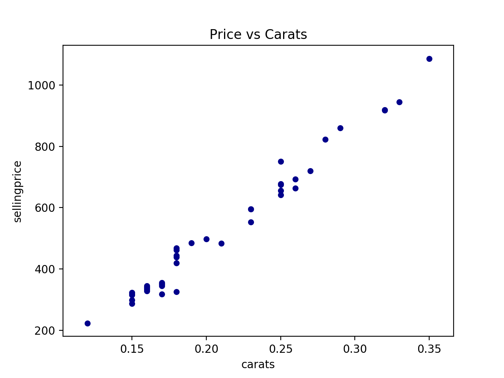
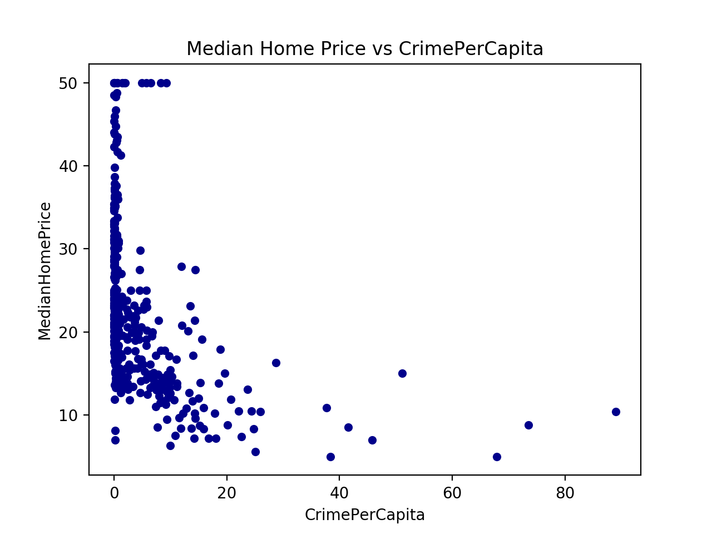

# Fitting-A-Regression-Line-in-Python
given dataset and plots, I try to fit a Regression line using Python programming

### For Carats case:
The OLS Regression Results shows us that:
For every 0.01 carat increase in the car size, we can expect the price to increase by 37.21 dollars
97.8% of the variability in price is up to the diamond size

### For Boston case that is imported from sklearn built in function:
The OLS Regression Results shows us that:
For every 100% increase in crime per capita, the expected decrease in the median home price is 412.80.
It is obviously a negative relationship. To learn more, go further. 
If there was no crimem we would expect the median home price to be 24016 dollars.
14.9% of the variability in price can be explained by the crime per capita.
The p-value of 0 associated with crime per capita suggests that it is statistically significant in providing info in predicting the median home values.
The correclation coefficient should be -0.386 due to negative relation displayed by scatter-plotting
